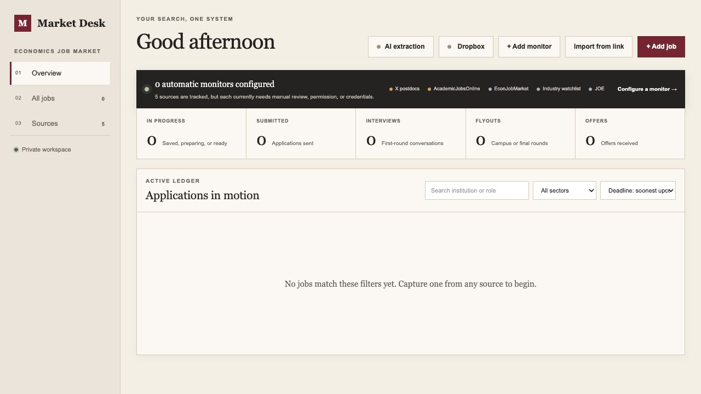

# Market Desk

Market Desk is a privacy-first, self-hosted application tracker for the economics job market. It combines job discovery, AI-assisted posting extraction, application requirements, document management, Dropbox backups, deadline sorting, and pipeline tracking in one private workspace.

This repository contains the application framework only. It contains no user jobs, application documents, API keys, Dropbox tokens, or deployed database.

## Interface preview




## What it does

- Imports individual public job-posting links and extracts their full description, employer, location, salary, deadline, and required materials.
- Supports JOE, EconJobMarket, AcademicJobsOnline, Interfolio, public X posts, and other readable public HTTPS job pages.
- Tracks active, maybe, skipped, preparing, submitted, interview, flyout, offer, and closed states.
- Sorts upcoming deadlines as real calendar dates and keeps rolling or missing deadlines at the bottom.
- Stores a checklist, private memo, and tailored application files with each job.
- Optionally copies application files to a personal Dropbox App folder.
- Uses the lowest-cost fixed OpenAI extraction model configured by the project.
- Keeps structured records in D1 and uploaded documents in R2.

## Privacy model

Market Desk is currently designed as a **single-user private deployment**. It does not partition records between multiple users.

Do not expose a deployed instance publicly. Configure the hosting access policy so that only the owner can open it. A public GitHub repository is safe because the repository contains code—not the separately provisioned D1 database, R2 files, hosted secrets, or encrypted connection records.

See [PRIVACY.md](PRIVACY.md) for the complete data boundary and [SECURITY.md](SECURITY.md) before deploying.

## Requirements

- A GitHub account with Codespaces access for the easiest browser-based setup; or
- Node.js 22.13 or newer and npm for local setup
- For local development, an operating system supported by Wrangler: macOS 13.5+, Windows 11, or Linux with glibc 2.35+

The local development server creates an emulated D1 database and R2 file store automatically. A hosted deployment needs D1 bound as `DB`, R2 bound as `FILES`, and two independent encryption secrets. An OpenAI API key and Dropbox API app are optional.

## Quick start

### GitHub Codespaces (easiest)

[](https://codespaces.new/alisonyzhao/market-desk?quickstart=1)

1. Open the link above and create or resume a codespace.
2. When its terminal is ready, install the pinned dependencies:

   ```bash
   npm ci
   ```

3. Create `.env.local` with two independent random encryption secrets:

   ```bash
   node -e 'const { randomBytes } = require("node:crypto"); const { writeFileSync } = require("node:fs"); writeFileSync(".env.local", `DROPBOX_TOKEN_KEY=${randomBytes(32).toString("base64")}\nOPENAI_KEY_ENCRYPTION_KEY=${randomBytes(32).toString("base64")}\n`);'
   ```

4. Start Market Desk:

   ```bash
   npm run dev -- --host 0.0.0.0
   ```

5. When GitHub reports that port 3000 is available, choose **Open in Browser**.

Each codespace has its own temporary local database and file store. Stop or delete it when you no longer need it.

### Local computer

1. Clone the repository and enter its folder:

   ```bash
   git clone https://github.com/alisonyzhao/market-desk.git
   cd market-desk
   ```

2. Install the pinned dependencies, create local encryption secrets, and start the app:

   ```bash
   npm ci
   node -e 'const { randomBytes } = require("node:crypto"); const { writeFileSync } = require("node:fs"); writeFileSync(".env.local", `DROPBOX_TOKEN_KEY=${randomBytes(32).toString("base64")}\nOPENAI_KEY_ENCRYPTION_KEY=${randomBytes(32).toString("base64")}\n`);'
   npm run dev
   ```

3. Open the local URL printed in the terminal. Your local D1 database and R2 files are stored under `.wrangler/`.

The local database, object-storage state, and secrets are ignored by Git. Never commit `.env.local`, `.dev.vars`, `.wrangler`, database files, or uploaded materials.

### Verify the installation

Run the complete release check from the project folder:

```bash
npm test
```

A successful installation ends with all tests passing and no failed tests.

## Deploying with Sites

The repository includes a projectless `.openai/hosting.json` declaring only the logical `DB` and `FILES` bindings. When creating a new Sites deployment, the platform should create a new project and provision fresh storage instead of connecting to another user's deployment.

Before using the deployed app:

1. Add `OPENAI_KEY_ENCRYPTION_KEY` and `DROPBOX_TOKEN_KEY` as secret runtime values.
2. Confirm the D1 binding is `DB` and the R2 binding is `FILES`.
3. Set access to owner-only/private.
4. Open AI extraction settings and add your own OpenAI API key if desired.
5. Create and authorize your own Dropbox App if desired.

Never copy another deployment's `project_id`, database, bucket, encryption secrets, or credentials into your version.

## Data storage

| Data | Storage | Included in Git? |
| --- | --- | --- |
| Jobs, statuses, notes, and checklists | D1 | No |
| Uploaded application files | R2 | No |
| Encrypted OpenAI and Dropbox connection records | D1 | No |
| Encryption secrets | Hosted secrets or ignored local environment | No |
| Application source and migrations | Git | Yes |
| Fictional social-preview content | `public/og.png` | Yes |

## AI extraction

AI extraction is optional. The user supplies their own OpenAI API key through the app. The key is encrypted before storage, never returned to the browser, and used only for user-initiated posting extraction. OpenAI response storage is disabled in extraction requests.

No generative API call should be assumed free. Review the configured model and current OpenAI pricing before use.

## Dropbox backup

Dropbox support is optional. Market Desk requests access only to its Dropbox App folder. The user supplies a Dropbox App key, authorizes their own account, and can disconnect without deleting files that were already copied to Dropbox.

## Source collection

Market Desk does not promise unrestricted crawling. Automatic monitors are intended for official RSS/Atom feeds, permitted JSON endpoints, or authorized APIs. One-link imports fetch a user-selected public page and may fail when a site requires sign-in, blocks automated requests, renders no readable data, or prohibits the request.

Contributors must preserve source-specific terms, robots directives where applicable, rate limits, and user-initiated collection boundaries.

## Development

```bash
npm run lint
npm test
npm run check:release
npm run db:generate
```

`npm test` performs a production build, regression tests, and the public-release privacy check.

## Contributing

Contributions are welcome. Read [CONTRIBUTING.md](CONTRIBUTING.md), especially the rules against committing real job records, application files, credentials, or deployment identifiers.

## License

Market Desk is available under the [MIT License](LICENSE).

## Independence

This project is not affiliated with or endorsed by the American Economic Association, EconJobMarket, AcademicJobsOnline, Interfolio, X, Dropbox, OpenAI, or any employer whose public posting may be imported by a user.
